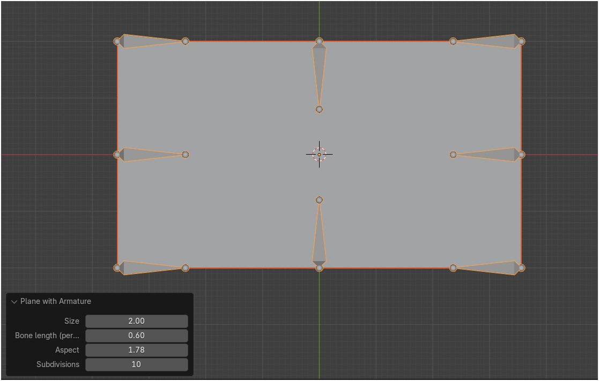

# Blender Armatured Plane
A Blender add-on to create a plane mesh with bones.  
  
Because sometimes, you need a plane with some bones on it. 

# Installation
Download [blender_armatured_plane.py](./blender_armatured_plane.py)

Blender > Edit > Preferences > Add-ons > Install from disk > Select blender_armatured_plane.py

# Usage
Add > Mesh > Plane with armature

Use menu to adjust plane size, bone length and subdivisions

